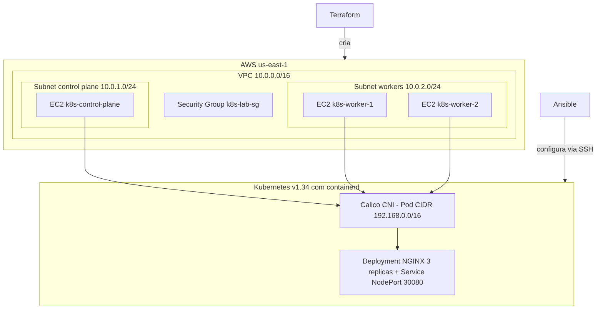

# [**Cluster Kubernetes na AWS com Terraform e Ansible**](https://github.com/EdinaPrado/k8s-terraform-ansible)

**Autor(a):** edina

Projeto que cria um cluster Kubernetes **sem usar EKS**, de forma automatizada, versionada e reproduzível:

- **Terraform** cria a infraestrutura na AWS (VPC, subnets, Internet Gateway, Security Group, Key Pair e 3 EC2).
- **Ansible** configura os servidores (Linux, containerd, kubeadm, kubelet, kubectl), inicializa o Control Plane, instala o Calico, junta os Workers automaticamente e publica um NGINX no cluster.

```text
Terraform → AWS → EC2 → Ansible → Linux → containerd → Kubernetes → Calico → NGINX
```

---

## 1. Arquitetura

### Diagrama



Versão em texto:

```text
AWS
 └── VPC 10.0.0.0/16
      ├── Subnet 10.0.1.0/24 ── EC2 k8s-control-plane
      └── Subnet 10.0.2.0/24 ── EC2 k8s-worker-1
                             └─ EC2 k8s-worker-2
                    │
                    ▼
               Kubernetes
                    │
                 Calico
                    │
                  NGINX
```

### Componentes

| Camada | Tecnologia |
|---|---|
| Infraestrutura como código | Terraform (providers `aws` e `local`) |
| Nuvem | AWS: VPC, 2 subnets, Internet Gateway, Route Table, Security Group, Key Pair |
| Servidores | 3 × EC2 `t3.small`, Ubuntu 24.04 LTS, disco gp3 de 20 GB |
| Configuração | Ansible (roles, handlers, templates, tags, loops, condições) |
| Runtime de containers | containerd (com `SystemdCgroup = true`) |
| Kubernetes | kubeadm, kubelet e kubectl v1.34 (repositório `pkgs.k8s.io`) |
| Rede do cluster | Calico v3.31.2 (Pod CIDR `192.168.0.0/16`) |
| Aplicação | Deployment NGINX (3 réplicas) + Service NodePort `30080` |

### Estrutura do repositório

```text
k8s-terraform-ansible/
├── terraform/
│   ├── versions.tf          # versões do Terraform e dos providers
│   ├── provider.tf          # provider AWS (com tags padrão Projeto/Aluno)
│   ├── variables.tf         # variáveis
│   ├── terraform.tfvars     # valores (IP de acesso SSH)
│   ├── vpc.tf               # VPC, subnets, IGW e route table
│   ├── security-group.tf    # regras de rede
│   ├── ec2.tf               # key pair, control plane e workers (count)
│   ├── outputs.tf           # IPs públicos e privados
│   ├── inventory.tf         # gera o inventory do Ansible (Extra 2)
│   └── inventory.tftpl      # modelo do inventory
├── ansible/
│   ├── ansible.cfg
│   ├── inventory.ini        # GERADO pelo Terraform (não editar)
│   ├── site.yml             # playbook principal
│   ├── group_vars/all.yml   # variáveis
│   └── roles/
│       ├── common/          # pacotes, hostname, /etc/hosts, swap, kernel, sysctl
│       ├── containerd/      # instala e configura o containerd
│       ├── kubernetes/      # kubeadm, kubelet, kubectl
│       ├── control-plane/   # kubeadm init, kubectl, Calico
│       ├── worker/          # join automático
│       └── nginx-app/       # Deployment e Service do NGINX
├── evidencias/              # logs e prints da execução
├── validar.sh               # valida o cluster e salva o log
├── README.md
└── .gitignore
```

---

## 2. Pré-requisitos

- Linux (o projeto foi feito no **Ubuntu sobre WSL2**, dentro do sistema de arquivos do Linux, por exemplo em `~/`)
- [Terraform](https://developer.hashicorp.com/terraform/install) **>= 1.5**
- [Ansible](https://docs.ansible.com/) **2.16 ou superior** com as coleções `ansible.posix` e `community.general`:

  ```bash
  ansible-galaxy collection install ansible.posix community.general
  ```

- Conta AWS com permissão para criar VPC, EC2 e Key Pair
- Cliente SSH e Git
- `curl` (para descobrir o IP público)

---

## 3. Configuração das credenciais AWS

As credenciais **nunca** são versionadas. Configure no seu computador, de uma das formas:

```bash
aws configure
```

ou por variáveis de ambiente:

```bash
export AWS_ACCESS_KEY_ID="..."
export AWS_SECRET_ACCESS_KEY="..."
export AWS_SESSION_TOKEN="..."       # somente se usar credenciais temporárias
export AWS_DEFAULT_REGION="us-east-1"
```

Confirme que funcionam:

```bash
aws sts get-caller-identity
```

---

## 4. Como executar o Terraform

**Passo 1. Criar o par de chaves SSH** (a chave privada fica só na sua máquina; o Terraform envia apenas a pública):

```bash
ssh-keygen -t ed25519 -f ~/.ssh/k8s-lab -N ""
```

**Passo 2. Liberar o SSH somente para o seu IP.** Dentro da pasta `terraform/`:

```bash
echo "my_ip_cidr = \"$(curl -4 -s ifconfig.me)/32\"" > terraform.tfvars
```

**Passo 3. Executar:**

```bash
cd terraform
terraform init
terraform fmt
terraform validate
terraform plan
terraform apply
```

Ao final, o Terraform mostra os outputs:

| Output | Descrição |
|---|---|
| `control_plane_public_ip` | IP público do Control Plane |
| `control_plane_private_ip` | IP privado do Control Plane |
| `worker_public_ips` | IPs públicos dos Workers |
| `worker_private_ips` | IPs privados dos Workers |

E **gera automaticamente** o arquivo `ansible/inventory.ini` com os IPs (Extra 2), usando `templatefile()` e o recurso `local_file`.

### Principais variáveis

| Variável | Padrão | Descrição |
|---|---|---|
| `aws_region` | `us-east-1` | Região da AWS |
| `instance_type` | `t3.small` | Tipo das instâncias (mínimo de 2 CPUs para o kubeadm) |
| `worker_count` | `2` | Quantidade de workers |
| `vpc_cidr` | `10.0.0.0/16` | CIDR da VPC |
| `control_plane_subnet_cidr` | `10.0.1.0/24` | Subnet do Control Plane |
| `workers_subnet_cidr` | `10.0.2.0/24` | Subnet dos Workers |
| `public_key_path` | `~/.ssh/k8s-lab.pub` | Chave pública enviada à AWS |
| `private_key_path` | `~/.ssh/k8s-lab` | Chave privada usada pelo Ansible |
| `my_ip_cidr` | (obrigatória) | Seu IP no formato `x.x.x.x/32` |
| `aluno` | `edina` | Nome que aparece nas tags dos recursos |

### Security Group

| Porta | Origem | Uso |
|---|---|---|
| TCP 22 | Somente o seu IP | SSH |
| TCP 6443 | Somente o seu IP | API Server do Kubernetes |
| TCP 10250 | Próprio Security Group | Kubelet |
| TCP 30000-32767 | `0.0.0.0/0` | NodePort |
| Todo o tráfego | Próprio Security Group | Comunicação entre os nós (inclui o Calico) |

---

## 5. Como executar o Ansible

```bash
cd ../ansible
ansible all -i inventory.ini -m ping
ansible-playbook -i inventory.ini site.yml
```

O playbook `site.yml` tem 5 plays, na ordem:

1. **Todos os nós:** roles `common`, `containerd` e `kubernetes`
2. **Control Plane:** role `control-plane` (`kubeadm init`, `kubectl` e Calico)
3. **Workers:** role `worker` (o comando `kubeadm join` é obtido do Control Plane pelo próprio Ansible, sem copiar nada manualmente)
4. **Validação:** espera os 3 nós ficarem `Ready`
5. **Aplicação:** role `nginx-app` (Deployment e Service)

### Roles

| Role | O que faz |
|---|---|
| `common` | Atualiza pacotes, configura hostname e `/etc/hosts`, desliga o swap, carrega os módulos `overlay` e `br_netfilter`, aplica os parâmetros de `sysctl` |
| `containerd` | Instala, gera a configuração, ativa `SystemdCgroup`, habilita e inicia o serviço |
| `kubernetes` | Adiciona o repositório oficial, instala `kubeadm`, `kubelet` e `kubectl`, trava as versões (`apt hold`) e habilita o kubelet |
| `control-plane` | Executa o `kubeadm init` (Pod CIDR `192.168.0.0/16`), configura `~/.kube/config` e instala o Calico |
| `worker` | Gera o comando de join no Control Plane (`delegate_to`) e executa nos workers |
| `nginx-app` | Aplica o Deployment (3 réplicas) e o Service NodePort 30080 |

### Tags

`pacotes`, `hosts`, `hostname`, `swap`, `kernel`, `sysctl`, `containerd`, `kubernetes`, `control-plane`, `kubeadm`, `kubectl`, `calico`, `worker`, `join`, `validacao`, `app`

Exemplo: `ansible-playbook -i inventory.ini site.yml --tags app`

### Idempotência

Rodar o playbook duas vezes seguidas termina com `changed=0` na segunda execução. Como foi garantido:

- `kubeadm init` usa `creates: /etc/kubernetes/admin.conf`
- o join só roda se `/etc/kubernetes/kubelet.conf` ainda não existir
- o Calico só é instalado se o DaemonSet `calico-node` ainda não existir
- a configuração do containerd é gerada a partir da configuração padrão, sempre com o mesmo resultado

---

## 6. Como acessar o Kubernetes

O `kubectl` está configurado no Control Plane, para o usuário `ubuntu`:

```bash
ssh -i ~/.ssh/k8s-lab ubuntu@$(cd terraform && terraform output -raw control_plane_public_ip)
kubectl get nodes
```

Ou, sem entrar na máquina, pelo Ansible:

```bash
cd ansible
ansible control_plane -a "kubectl get nodes"
```

---

## 7. Como validar o cluster

O script `validar.sh` roda todos os comandos de validação e salva o resultado em `evidencias/05-validacao.log`:

```bash
./validar.sh
```

Ou manualmente, no Control Plane:

```bash
kubectl get nodes
kubectl get pods -A
kubectl get svc -A
kubectl get deployment
kubectl get pods
kubectl get svc
```

Resultado esperado:

```text
NAME                STATUS   ROLES           AGE
k8s-control-plane   Ready    control-plane   ...
k8s-worker-1        Ready    <none>          ...
k8s-worker-2        Ready    <none>          ...
```

No `kubectl get pods -A` devem aparecer, todos `Running`: `calico-node` (um por nó), `calico-kube-controllers`, `coredns`, `etcd`, `kube-apiserver`, `kube-controller-manager`, `kube-proxy` e `kube-scheduler`.

---

## 8. Como acessar a aplicação

A aplicação NGINX responde em qualquer nó do cluster, na porta `30080`:

```text
http://IP_PUBLICO_DO_WORKER:30080
```

Os IPs vêm de `terraform output worker_public_ips`. A página mostra **"Kubernetes na AWS"**, o nome do pod que respondeu e o nome do aluno. Ao repetir a requisição, o nome do pod muda, mostrando o balanceamento entre as 3 réplicas:

```bash
for i in 1 2 3 4 5 6; do curl -s http://IP_PUBLICO_DO_WORKER:30080 | grep -o "Pod: [a-z0-9-]*"; done
```

**Se a sua rede bloquear a porta 30080**, use um túnel SSH pelo Control Plane e abra `http://localhost:8080`:

```bash
ssh -f -N -i ~/.ssh/k8s-lab -L 8080:localhost:30080 ubuntu@$(cd terraform && terraform output -raw control_plane_public_ip)
curl -s http://localhost:8080
pkill -f "8080:localhost:30080"     # fecha o túnel
```

---

## 9. Como destruir a infraestrutura

```bash
cd terraform
terraform destroy
```

Depois, confira no Console da AWS (região `us-east-1`) que não sobrou nada. Todos os recursos têm a tag `Projeto = k8s-terraform-ansible`, então dá para filtrar por ela em:

- **EC2 → Instances** (3 instâncias `terminated`)
- **EC2 → Key Pairs**
- **EC2 → Security Groups**
- **VPC → Your VPCs**, **Subnets**, **Internet Gateways** e **Route Tables**

> ⚠️ Os comandos `terraform` precisam ser executados dentro da pasta `terraform/`. As instâncias geram custo enquanto existirem.

---

## 10. Problemas encontrados e como foram resolvidos

| Problema | Causa | Solução |
|---|---|---|
| `"SEU_IP_AQUI/32" is not a valid CIDR block` | O `terraform.tfvars` ainda estava com o texto de exemplo | Gravar o IP real com `curl -4 -s ifconfig.me` (o `-4` força IPv4) |
| `InvalidKeyPair.Duplicate` | Já existia um key pair com o mesmo nome na conta | Nome do key pair com o sufixo do aluno (`k8s-lab-key-${var.aluno}`) |
| `Blocks of type "default_tags" are not expected here` | O bloco ficou fora do `provider "aws"` | Reescrever o `provider.tf` inteiro, com o bloco dentro do provider |
| `unsupported option "accept-newaccept"` no SSH | A opção do inventory foi duplicada ao colar no editor | Recriar o arquivo pelo terminal; depois o inventory passou a ser gerado pelo Terraform |
| `curl` na porta 30080 com `Connection timed out` | A rede local bloqueia portas altas (o Security Group libera) | Validação de dentro da AWS (`curl localhost:30080` no Control Plane) e túnel SSH pela porta 22 |
| `terraform destroy` respondeu "No objects need to be destroyed" | Foi executado na pasta `ansible/`, sem arquivos Terraform | Executar sempre dentro de `terraform/` |
| Nome do host trocado de volta após reiniciar | O cloud-init reescreve o hostname a cada boot | Arquivo `/etc/cloud/cloud.cfg.d/99-preserve-hostname.cfg` com `preserve_hostname: true` |
| Kubelet e containerd com drivers de cgroup diferentes | O `config.toml` padrão usa `SystemdCgroup = false` | A role `containerd` troca para `true` |

---

## Extras realizados

- **Extra 2. Inventory automático:** o Terraform gera `ansible/inventory.ini` com `templatefile()` e `local_file`.

---

## Evidências

Os logs completos da execução ficam em `evidencias/`:

| Arquivo | Conteúdo |
|---|---|
| `01-terraform-apply.log` | `terraform apply` criando toda a infraestrutura |
| `02-ansible-ping.log` | `ansible all -m ping` com os 3 servidores |
| `03-ansible-playbook-1a-execucao.log` | Primeira execução do playbook |
| `04-ansible-playbook-2a-execucao.log` | Segunda execução, com `changed=0` (idempotência) |
| `05-validacao.log` | `kubectl get nodes/pods/svc/deployment` e teste do NGINX |
| `06-terraform-destroy.log` | `terraform destroy` removendo tudo |

Prints (pasta `evidencias/prints/`): `terraform apply`, `ansible-playbook`, `kubectl get nodes`, `kubectl get pods -A`, `kubectl get svc`, NGINX funcionando no navegador e Console da AWS após o `destroy`.
